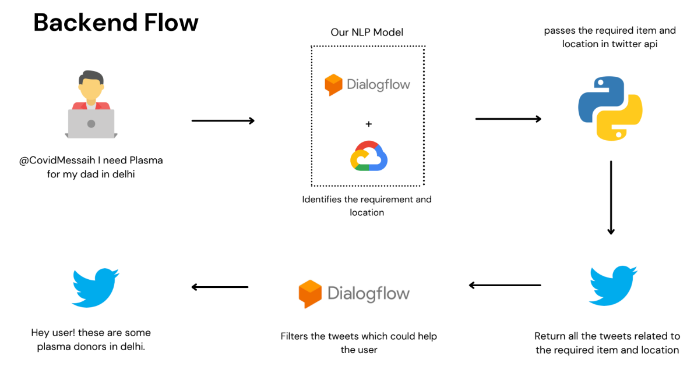
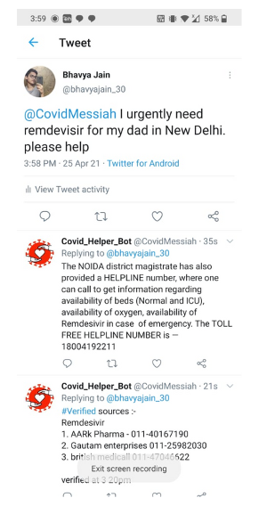

# CovidMessiah 🤖

**CovidMessiah** is a project that secured 4th position among 200+ teams in a Hackathon. It addresses the real-time problem of providing users with verified COVID-19 leads through Twitter, offering instant and relevant information.

---

## 📸 Screenshots

### Overview

### How It Works

---

## 🚀 Key Features

- 🏆 **Ranked 4th** in a Hackathon with 200+ teams.
- 📊 **Generated over 5000+ verified COVID leads** on Twitter.
- 🤖 **Deployed an NLP model** using Google Dialogflow to process user tweets and reply with relevant information.
- 🧰 **Tech Stack**: Twitter API, Dialogflow, Python, Google Cloud.

---

## 🛠️ Tech Stack

- **Programming Language**: Python
- **NLP Model**: Dialogflow (Google)
- **Cloud Services**: Google Cloud
- **API**: Twitter API
- **Dataset**: Twitter data (fetched via API)

---

## 🗂️ Dataset

- The data was sourced in real-time from Twitter using the **Twitter API**, ensuring up-to-date and accurate information.

---

## 📊 Results

- Processed over **5000+ tweets**, helping users connect with verified COVID leads.
- Achieved a **response time of less than 3 seconds** for tweet processing and replying.

---

---
## 🌟 Hackathon Highlights

- Solved a real-world problem during the pandemic, making a positive impact on society.
- Collaborated as a team to integrate **AI**, **cloud technologies**, and **social media APIs**.

---

## 🤝 Contributors

- **Harsh** , **Soham** , **Bhavya** , **Aman** 

---

## 📬 Contact

Feel free to reach out with any questions or suggestions!  
Email: [harshgarg1808@gmail.com](mailto:harshgarg1808@gmail.com)  
LinkedIn: [harshgarg1808](https://www.linkedin.com/in/harsh-garg-82466b190/)
